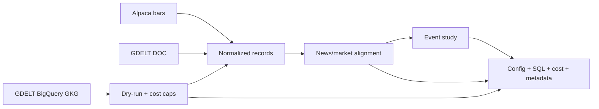

# Kinetic Trading

Kinetic Trading is a reproducible market-and-news research system. Its current local application is a human annotation and audit workstation for the semiconductor relevance benchmark. It is not a public trading dashboard or live market terminal.

The system pulls Alpaca historical bars and GDELT news through the DOC API and BigQuery GKG, then builds aligned news × market datasets and event-study summaries.

Each run stores its resolved configuration, metadata, outputs, and—when BigQuery is used—the generated SQL and cost estimate. Runs are preserved under `experiments/` so results can be inspected and reproduced later.

> Kinetic Trading is a research system. It does not place trades or claim predictive returns.

[](https://github.com/KevinXT/kinetic-trading/actions/workflows/ci.yml)


## What is implemented

| Area | Capability |
| --- | --- |
| Inputs | Alpaca bars; GDELT DOC articles; BigQuery GKG counts and theme research |
| Pipeline execution | YAML plans via `pipeline_core`, tasks registered in `trading_platform` |
| Storage | Idempotent JSONL writes for market and news records |
| Cloud controls | BigQuery dry-run first, byte caps, spend policy + ledger (`configs/cost_policy.yaml`) |
| Research outputs | Leakage-aware alignment, event studies, run artifacts under `experiments/` |
| Relevance benchmark | Versioned article-text records, exact/near dedupe, human annotation workflow, chronological splits, deterministic entity-rule baselines, offline metrics |
| Validation | Offline pytest, Ruff, scoped Black/mypy, wheel import smoke on Python 3.11/3.12 |

## Run the offline demo

No API keys or BigQuery credentials are required.

<details>
<summary>Development installation</summary>

```bash
git clone https://github.com/KevinXT/kinetic-trading.git
cd kinetic-trading
python3 -m venv .venv
source .venv/bin/activate

python3 -m pip install -e ./packages/common \
  -e ./packages/pipeline_core \
  -e ./packages/news_data \
  -e ./packages/market_data \
  -e ./packages/research_data \
  -e ./packages/strategy_sdk \
  -e ./apps/trading_platform \
  -e ".[dev]"
```

</details>

```bash
python3 -m trading_platform configs/research/news_market_dataset_demo.yaml --run-id readme_offline_demo
```

```text
completed run: news_market_dataset_demo
run_id: readme_offline_demo
outputs: experiments/news_market_dataset_demo/readme_offline_demo
```

Useful files in that run: `artifacts/dataset_manifest.json`, `news_market_observations.csv`, and `event_study_summary.json`.

For BigQuery, set a real project ID in the ignored `configs/local.yaml`; checked-in configs use `YOUR_PROJECT_ID`.

```bash
python3 -m trading_platform configs/research/semiconductors_seeded_theme_scoring_30d_dryrun.yaml
```

Live execution uses a matching `*_execute.yaml`, requires an explicit `execute_query: "ENABLE"` gate, and can incur cost. More research configs are under [`configs/research/`](configs/research/); theme codes for topics are listed in [`configs/gdelt_theme_bundles.yaml`](configs/gdelt_theme_bundles.yaml).

## Data flow



YAML configs drive `pipeline_core`; `news_data` and `market_data` own the provider adapters; `research_data` builds the join and event study. Pipeline BigQuery tasks estimate bytes before execution and reject queries that exceed the configured caps. That matters because a GKG scan bills on bytes read, not on how selective the `WHERE` clause looks.

Scoring tasks write review artifacts only. They do not edit production theme bundles. Credentials stay in `.env` / `configs/local.yaml`, both gitignored.

## Case study: testing GDELT themes for semiconductor news

**Hypothesis.** GDELT theme codes might already give us a semiconductor taxonomy.

**Method.** Compare GKG records that mention semiconductor companies with a disjoint background over the same 30-day window, correct for testing more than 1,300 themes, and check whether hits were dominated by one source, date, or seed company.

| Metric | Result |
| --- | ---: |
| Window | 30 days |
| Seeded records | 40,334 |
| Theme hypotheses tested | 1,359 |
| Reliable semiconductor identity themes | 0 |
| Scan / estimate | 10.624 GiB / ≈ $0.0648 |

**Result.** Contextual themes appeared around manufacturing, servers, storage, and macroeconomic news, but none worked as a reliable semiconductor identity label. No themes were promoted into the production bundle. The next approach is entity resolution plus text classification rather than another theme-code search.

Full write-up: [semiconductor theme scoring](docs/research/semiconductor-theme-scoring/).

## Next foundation: semiconductor relevance benchmark

Because themes failed as an identity layer, the repository now includes an **offline, human-label-ready article relevance benchmark**:

- Versioned `ArticleTextRecordV1` research records and a local JSONL corpus provider
- Conservative exact duplicate clustering plus near-duplicate **review candidates**
- Blind annotation workflow with raw labels preserved and separate adjudication
- Duplicate-cluster-aware chronological development / validation / holdout splits
- Transparent deterministic entity-rule baselines (no ML, embeddings, or GPU)
- Offline metrics with Wilson intervals and explicit undefined-metric nulls

```bash
python3 -m trading_platform \
  configs/research/semiconductor_relevance_benchmark_offline.yaml \
  --run-id semiconductor_relevance_benchmark_offline
```

No `.env`, credentials, BigQuery, Alpaca, network, or GPU are required for that command.

Design: [semiconductor relevance benchmark](docs/research/semiconductor_relevance_benchmark_design.md).  
Annotation guidelines: [relevance annotation guidelines](docs/research/semiconductor_relevance_annotation_guidelines.md).

This phase does **not** implement a text classifier, sentiment model, or trading signal. Fixture metrics are synthetic test ground truth, not real-world model performance. Human labels and coverage remain limited. No trading system consumes these outputs. No predictive return has been demonstrated.


## Real-corpus relevance annotation pilot

A second offline task prepares rights-aware sampling, calibration, duplicate-pair review, and readiness gates for a local rights-cleared corpus:

```bash
python3 -m trading_platform \
  configs/research/semiconductor_relevance_real_corpus_pilot_local.yaml \
  --run-id semiconductor_relevance_real_corpus_pilot_local
```

Protocol: [real-corpus pilot protocol](docs/research/semiconductor_relevance_real_corpus_pilot_protocol.md).

Synthetic fixtures validate the machinery only. Without a rights-cleared local corpus under ignored `data/real_corpus/`, real-pilot execution remains blocked. This does not implement models, sentiment, return prediction, or trading.

> Do not ingest real article bodies until the content-safety regression tests pass and the remediation commit is checked out. Rejected import rows serialize safe summaries only (no full bodies). Finite-population correction applies only to prevalence-precision planning; class-denominator requirements that exceed \(N\) remain visibly underpowered.

## Local Relevance Annotation Workstation

The current local application is a **trusted Streamlit workstation** for corpus preflight, blind article relevance annotation, duplicate review, adjudication, and deterministic export. It is a thin human-review layer over the existing `news_data` / `research_data` CLI engine — not a public trading dashboard or live market terminal.

- Local-only bind (`127.0.0.1`); usage stats disabled
- Single selected pilot-run context; assignments bound to run/corpus/article hashes
- Durable annotation events in ignored SQLite (`data/local_only/relevance_annotation_ui.sqlite3`)
- Stable UI submission tokens (double-click / rerun idempotent); append-only history
- Batch-scoped exports preserve stored guideline versions and sample roles
- Real article bodies stay in ignored local storage; exports omit bodies by default
- Does **not** run models, calculate sentiment, predict returns, or place trades
- Mode selection (`preflight` / `annotator` / `duplicate_reviewer` / `adjudicator` / `audit`) is workflow separation, not multi-tenant security
- Suitable for a five-article rights-cleared smoke test after remediation validation; no real pilot has been completed

```bash
python3 -m pip install -e ./apps/relevance_annotation_ui
python3 -m streamlit run apps/relevance_annotation_ui/app.py
```

Config: [`configs/research/semiconductor_relevance_annotation_ui_local.yaml`](configs/research/semiconductor_relevance_annotation_ui_local.yaml).  
App notes: [`apps/relevance_annotation_ui/README.md`](apps/relevance_annotation_ui/README.md).

## Validation

GitHub Actions runs on Python 3.11 and 3.12: offline `pytest`, Ruff, Black on the market-data/research scopes, mypy on `common` / `market_data` / `pipeline_core` / `research_data`, plus wheel builds and an isolated import smoke test.

```bash
pytest -q
ruff check .
```

## Current limitations

GDELT records are noisy media annotations rather than unique articles. Organization matching can include irrelevant mentions, and the repository does not yet include a text relevance classifier for semiconductor news.

## Documentation

Deeper documentation: [semiconductor theme scoring](docs/research/semiconductor-theme-scoring/), [news × market dataset design](docs/research/news_market_dataset_design.md), [financial-data architecture](docs/architecture/financial-data.md), and the [documentation index](docs/README.md).
