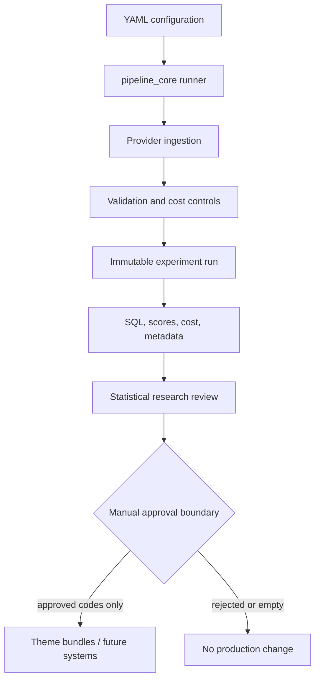
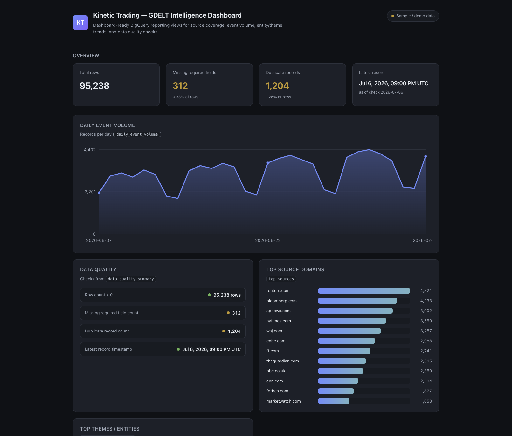

# Kinetic Trading

Kinetic Trading is a research-oriented market data platform that collects financial and news data, runs reproducible experiments, and keeps unreviewed research outputs out of trading systems.

It is **not** a brokerage, order router, autonomous trader, or profitability engine. The point of the project is reliable ingestion, clear package boundaries, cloud cost control, and research workflows that are easy to audit.

[](https://github.com/KevinXT/kinetic-trading/actions/workflows/ci.yml)


## What is implemented now

- Config-driven pipelines with a task registry and per-run artifacts
- Alpaca historical US stock-bar ingestion into normalized `PriceBar` records
- Deterministic JSONL storage with idempotent upserts
- GDELT DOC ingestion plus BigQuery GKG research paths
- Dry-run / live gates, byte caps, and a spend policy for BigQuery
- Seeded theme discovery and complete-family statistical theme scoring
- Leakage-aware news × market research datasets and offline event-study reporting
- Offline test suite (live provider calls are opt-in)
- Local reporting dashboard over committed sample JSON

Planned but **not** implemented: live order execution, multi-provider market coverage beyond Alpaca bars, SEC EDGAR / FRED adapters, and a text-based semiconductor relevance classifier.

## Why this is hard

Public news datasets are noisy. Company aliases create false positives (`intel` vs `intelligence`). BigQuery scans cost money even when a `WHERE` clause filters rows. At large candidate counts, raw p-values overstate discovery. Research outputs must not silently become trading inputs. Reproducibility means keeping SQL, config, cost decisions, and run metadata together.

## Latest experiment: Are GDELT themes useful for semiconductor identification?

**Hypothesis:** GDELT GKG theme codes can act as a primary semiconductor identity layer.

**Method:** Match semiconductor companies and industry phrases in `V2Organizations` with token-safe rules, score every support-qualified theme against a disjoint non-seed background in one partition-pruned scan, correct for multiple testing over the complete family, check exact source/day/seed concentration, classify with deterministic rules, and refuse automatic promotion into the production theme bundle.

**Verdict:** Rejected as a primary semiconductor identity layer. Themes may remain useful as contextual features. Semiconductor relevance should be established through entity resolution and text-based classification instead.

| Metric | Result |
| --- | ---: |
| Window | 30 days (2026-06-17 → 2026-07-16) |
| Seeded GKG records | 40,334 |
| Non-seed background records | 7,607,554 |
| Support-qualified themes | 1,359 |
| Complete hypothesis family | Yes (cap 5,000) |
| Hypothesis tests | 1,330 z-tests + 29 Fisher exact |
| Multiple-testing correction | Benjamini–Hochberg over 1,359 |
| Query scan | 10.624 GiB |
| Estimated cost | $0.0648 |
| Numerically screened candidates | 185 |
| `industry_core` classifications | 0 |
| Production themes promoted | 0 |

The run found many statistically enriched themes around semiconductor organizations — manufacturing, servers, storage, inflation, currencies, monetary policy. None functioned as a reliable semiconductor identity label under the current rules. The production `semiconductors` bundle stayed empty.

What made the negative result useful:

- complete-family FDR (BH was not applied to a truncated top-N list)
- disjoint seed / non-seed comparison
- Fisher exact for sparse 2×2 tables
- exact concentration checks for every candidate
- deterministic evidence sampling for human review
- production immutability (no auto-promotion)
- automatic human-readable research report

Curated snapshot (sanitized; raw `experiments/` stays gitignored): [docs/research/semiconductor-theme-scoring/](docs/research/semiconductor-theme-scoring/).

## Architecture



Scoring and discovery only write review artifacts. They never update the production theme lists used by later pipelines. If a topic’s theme list is still empty (as semiconductors is today), any job that depends on it stops with an error instead of guessing codes.

| Layer | Responsibility |
| --- | --- |
| `pipeline_core` | Config load, plan parse, task dispatch, artifacts |
| `market_data` | Domain models, Alpaca adapter, JSONL financial store |
| `news_data` | GDELT DOC + BigQuery path, seed matching, theme scoring |
| `research_data` | Calendar alignment, leakage-checked join, event study |
| `common` | Shared cache, YAML merge, cost policy primitives |
| `trading_platform` | CLI composition root and task registration |

## Engineering safeguards

- BigQuery always dry-runs before a billable query
- `maximum_bytes_billed` and typed `execute_query: "ENABLE"` gate
- Cost policy + ledger with single-query / daily / monthly caps
- Cache hit/miss recorded in artifacts
- Generated SQL stored beside results
- Run metadata records git commit, window, and task params
- Production theme bundles are immutable from scoring tasks
- Complete-family statistical safeguards; incomplete families skip BH
- Secrets stay in environment variables / ignored `configs/local.yaml`

## Repository layout

```text
packages/
  common/            Shared YAML merge, cache, cost policy
  pipeline_core/     Runner, parser, hooks, task registry
  news_data/         GDELT DOC + BigQuery research path
  market_data/       Price domain models and Alpaca path
  research_data/     News × market alignment and event study
  strategy_sdk/      Reserved boundary (intentionally empty)
apps/
  trading_platform/  CLI and task registration
  reporting_dashboard/ Local sample-data dashboard
configs/             Demo, research, cost policy, theme bundles
docs/                Architecture and research write-ups
tests/               Offline suite + opt-in live provider tests
```

## How to run

Credentials are not required for the offline test suite, the research demo, or the local dashboard.

```bash
git clone https://github.com/KevinXT/kinetic-trading.git
cd kinetic-trading

python3 -m venv .venv
source .venv/bin/activate

python3 -m pip install -e ./packages/common \
  -e ./packages/pipeline_core \
  -e ./packages/news_data \
  -e ./packages/market_data \
  -e ./packages/research_data \
  -e ./packages/strategy_sdk \
  -e ./apps/trading_platform \
  -e ".[dev]"

pytest -q
```

Offline news × market demo (no network):

```bash
python3 -m trading_platform configs/research/news_market_dataset_demo.yaml
```

Safe BigQuery dry-run example (needs a real `providers.bigquery.project_id` via ignored `configs/local.yaml`):

```bash
python3 -m trading_platform configs/research/semiconductors_seeded_theme_scoring_30d_dryrun.yaml
```

Live BigQuery execution incurs cost. Run only after reviewing the dry-run estimate:

```bash
python3 -m trading_platform configs/research/semiconductors_seeded_theme_scoring_30d_execute.yaml
```

Configs ship with `project_id: "YOUR_PROJECT_ID"`. Do not commit real project ids or credentials.

Additional partition-pruned research configs live under `configs/research/`, including inflation dry-runs and executes (`inflation_rates_bigquery_7d_partition_dryrun.yaml`, `inflation_rates_bigquery_30d_partition_dryrun.yaml`, `inflation_rates_bigquery_30d_partition_execute.yaml`, `inflation_rates_bigquery_1y_partition_dryrun.yaml`) and GDELT theme-discovery pairs (`debug_gdelt_themes_inflation_30d_partition_dryrun.yaml`, `debug_gdelt_themes_inflation_30d_partition_execute.yaml`). Research topics map to GKG theme codes via the theme bundle definitions in `configs/gdelt_theme_bundles.yaml`.

## Validation status

Verified on branch tip `feature/semiconductor-theme-scoring` (2026-07-16):

| Check | Result |
| --- | --- |
| Full offline pytest | 2032 passed, 8 skipped |
| Ruff | passed |
| Task-scoped Black (changed scoring files) | passed |
| CI mypy target (`common`, `market_data`, `pipeline_core`, `research_data`) | passed |
| mypy on changed scoring modules | passed |
| Repository-wide Black | 21 pre-existing files still require formatting |

CI runs Black only on the owned market-data / research-data scopes, not the full tree. Live Alpaca tests require `RUN_PROVIDER_INTEGRATION_TESTS=1` and are skipped in CI.

## Current limitations

- No demonstrated predictive returns
- No production trading connection
- GDELT GKG records are not unique articles
- Entity, language, and publisher bias remain
- The semiconductor seed corpus in the latest run is NVIDIA-heavy
- A text-based relevance classifier is not implemented yet
- Generated research is auditable evidence, not scientific proof of market edge
- Some packages are research-stage; `strategy_sdk` is intentionally empty

## Roadmap

Next experiment: build a small human-labeled semiconductor-relevance benchmark and compare deterministic entity matching against an entity-and-text classifier using held-out precision, recall, F1, calibration, and abstention.

## Local dashboard



Screenshots use committed sample JSON matching the BigQuery reporting-view schemas; they are not live production feeds.

```bash
cd apps/reporting_dashboard
python3 -m http.server 8000
# open http://localhost:8000
```

## Documentation

| Doc | Purpose |
| --- | --- |
| [Semiconductor theme scoring snapshot](docs/research/semiconductor-theme-scoring/) | Latest real BigQuery experiment and negative verdict |
| [News × market dataset design](docs/research/news_market_dataset_design.md) | Alignment, leakage rules, hypotheses, artifacts |
| [Financial data architecture](docs/architecture/financial-data.md) | Domain identity, Alpaca path, cache, storage |
| [Config builder](docs/guides/config-builder.md) | YAML `include:` / merge behavior |
| [Docs index](docs/README.md) | Full documentation map |
