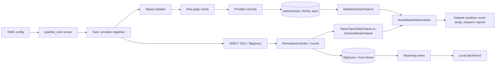

# Kinetic Trading

A cost-controlled financial and news-data research platform that ingests provider data, normalizes it into stable domain models, persists it deterministically, and exposes reproducible reporting and research workflows.

It is **not** a brokerage, order router, autonomous trader, profitability engine, or generic stock dashboard. The engineering focus is reliable ingestion, clear package boundaries, cloud/API cost guardrails, and a leakage-aware research layer that aligns news with market data without look-ahead.

[](https://github.com/KevinXT/kinetic-trading/actions/workflows/ci.yml)


## Technical highlights

- **Provider-neutral domain contracts** for prices, filings, company facts, and macro observations, with a **fully implemented Alpaca `PriceBar` ingestion path**. Only normalized records cross provider boundaries.
- **Alpaca historical stock bars**: multi-symbol pagination, bounded retries, raw-page caching keyed by normalized API origin, and normalization into `PriceBar`.
- **Deterministic JSONL storage**: atomic rewrites, exclusive writer locks, idempotent logical-key upserts, and semantic equality that ignores volatile `retrieved_at` metadata.
- **Cost-aware BigQuery path**: dry-run estimates, partition-pruning guardrails, query-size limits, and a spend policy/ledger.
- **GDELT news ingestion**: DOC/artlist path plus historical BigQuery GKG counts, theme bundles, and local reporting views.
- **Leakage-aware research datasets**: align timestamped GDELT news with Alpaca market sessions using explicit pre-open availability cutoffs, versioned topic mappings, structurally separated inputs and targets, deterministic manifests, and offline event-study reporting.
- **Registry-based composition**: YAML pipelines, a task registry, and per-invocation provider registries with no global mutable provider state.
- **Offline-first test suite**: fake-transport coverage for pagination, retries, cache, normalization, storage, and secret redaction; live provider tests are opt-in and CI runs the offline suite only.

## Architecture



| Layer | Responsibility |
| --- | --- |
| `pipeline_core` | Config load, plan parse, task dispatch, artifacts — no provider knowledge |
| `market_data` / `news_data` | Provider clients, validation, normalization, domain-specific storage |
| `research_data` | Calendar/availability alignment, feature builders, leakage-checked join, event study, manifest |
| `common` | Shared cache, YAML merge, cost policy primitives |
| `trading_platform` | CLI composition root and task registration |

Alpaca and GDELT are separate ingestion paths that share the same runner, cache, and artifact conventions. The `research_data` layer is a **derived product** that consumes both normalized sources; it never replaces them and is not a trading signal.

## Reliability and research-integrity decisions

**Ingestion and storage**

- **Cache raw pages before normalization** so retries and re-runs do not re-hit the provider for identical historical requests. Alpaca cache identity includes the normalized `api_origin` (schema `alpaca-bars-v2`), so production, sandbox, mock, and proxy responses cannot share entries.
- **Bound pagination and retries** with maximum page counts, token-loop detection, backoff caps, and no retry on ordinary 4xx failures.
- **Idempotent logical-key upserts** with atomic writes and exclusive locks. Semantic equality excludes `retrieved_at`, so force-refreshing identical OHLCV is a skip that preserves first-seen provenance instead of a false correction.
- **BigQuery dry runs and cost caps fail closed** before expensive scans; partition filters are required for research configs.
- **Secrets stay in environment variables.** Caches, logs, artifacts, and examples carry env var *names*, never credential values. Live provider tests are opt-in (`RUN_PROVIDER_INTEGRATION_TESTS=1`).

**Research integrity**

- **Pre-open feature cutoff.** Inputs are aggregated to `target_session_open - cutoff_buffer_seconds` (default 300s). Equality at the cutoff is allowed; the buffer is operational conservatism, not a provider-latency model.
- **Alignment precision follows source capability.** DOC records support article-timestamp windows; BigQuery counts have no timestamps and reject exact-window alignment unless an explicit `daily_approximation` downgrade is enabled and recorded.
- **Structural input/target separation.** Every field belongs to exactly one category — identity, lineage, availability, **input** (lag-only), **contemporaneous** (same-session, not a predictor), **forward target**, quality, or diagnostic — and the separation is validated per row.
- **Measured zero, unsupported, and missing are distinct** and never collapsed to `0`.
- **No profitability, causal, or execution claims.**

Detailed hypotheses, bootstrap method, FDR families, target-horizon formulas, availability assumptions, calendar scope, and the full limitations live in the [research dataset design](docs/research/news_market_dataset_design.md).

## Quick start

Credentials are **not** required for the offline test suite, the research demo, or the local dashboard.

```bash
git clone https://github.com/KevinXT/kinetic-trading.git
cd kinetic-trading

python3 -m venv .venv
source .venv/bin/activate

python3 -m pip install -e ./packages/common \
  -e ./packages/pipeline_core \
  -e ./packages/news_data \
  -e ./packages/market_data \
  -e ./packages/research_data \
  -e ./packages/strategy_sdk \
  -e ./apps/trading_platform \
  -e ".[dev]"

pytest -q
```

### Optional network / provider workflows

These require network access and, in some cases, credentials or a cloud project.

```bash
# GDELT DOC demo (network call to GDELT; no cloud credentials)
python3 -m trading_platform configs/demo.yaml

# Live Alpaca historical bars (requires Alpaca credentials)
export ALPACA_API_KEY_ID="..."
export ALPACA_API_SECRET_KEY="..."
python3 -m trading_platform configs/alpaca_daily_bars.yaml
```

BigQuery research configs are partition-pruned and require a real project id via `configs/local.yaml`. Always dry-run before executing; execute configs are explicitly gated.

```bash
python3 -m trading_platform configs/research/inflation_rates_bigquery_30d_partition_dryrun.yaml
python3 -m trading_platform configs/research/inflation_rates_bigquery_30d_partition_execute.yaml
```

Additional partition-pruned configs live under `configs/research/`, including shorter and longer inflation dry-runs (`inflation_rates_bigquery_7d_partition_dryrun.yaml`, `inflation_rates_bigquery_1y_partition_dryrun.yaml`) and GDELT theme-discovery pairs (`debug_gdelt_themes_inflation_30d_partition_dryrun.yaml`, `debug_gdelt_themes_inflation_30d_partition_execute.yaml`). Research topics map to GKG theme codes via the theme bundle definitions in `configs/gdelt_theme_bundles.yaml`.

## Offline research demo

The strongest single demonstration of the platform is the fully offline news × market dataset build — no Alpaca, BigQuery, GDELT, or internet access:

```bash
python3 -m trading_platform configs/research/news_market_dataset_demo.yaml
```

```text
GDELT articles / historical counts        Alpaca PriceBar records
              |                                      |
   NewsTopicDailyFeature                    MarketSessionFeature
              |                                      |
   SessionNewsFeature  ----→ NewsMarketObservation ←----
                                     |
              dataset manifest · event study · research reports
```

- **Row grain:** one `topic × instrument × aligned market session × feature cutoff × mapping version × dataset version`.
- **Default alignment:** `session_information_window_v2` aggregates timestamped DOC news over `[previous session close → feature_cutoff]`.
- **DOC vs BigQuery:** DOC supports article-level breadth, source concentration, and publication-timing features; BigQuery GKG counts support volume only, with richer fields emitted as `null` (never a fabricated `0`) and tagged by per-row `feature_capabilities`.
- **Separation:** inputs (lag-only), contemporaneous descriptors, forward targets, quality, and lineage are kept in distinct groups and validated.
- **Event study:** attention events use a lag-only `attention_zscore_30 ≥ threshold` rule (config-driven, not chosen after seeing returns); eligible H1 inference uses a session-date moving-block bootstrap with Benjamini–Hochberg correction inside the H1 family, and undersized groups get null CIs/p-values.

The run emits normalized feature tables, joined JSONL/CSV observations, a feature catalog, a dataset manifest, join diagnostics, event-level records, summary statistics, and a generated `research_limitations.md` (per run, not committed). Full schema, methodology, and artifact reference: [research dataset design](docs/research/news_market_dataset_design.md).

Representative observation (trimmed; groups kept separate):

```json
{
  "topic": "semiconductors",
  "symbol": "AMD",
  "session_date": "2026-05-04",
  "inputs": {
    "news_attention_zscore_30": null,
    "mkt_prior_simple_return": null
  },
  "contemporaneous": {
    "mkt_volume": 21168255
  },
  "targets": {
    "target_session_return": 0.005708
  },
  "quality": {
    "target_through_plus_4_complete": true
  }
}
```

## Repository map

```text
packages/
  common/            Shared YAML merge, cache, errors, cost policy/ledger
  pipeline_core/     Runner, parser, hooks, RunContext, task registry
  news_data/         GDELT DOC + BigQuery path, transforms, reporting views
  market_data/       Domain models, Alpaca adapter, JSONL financial store
  research_data/     News×market layer: calendar, alignment, features, join, event study
  strategy_sdk/      Reserved boundary (intentionally empty)
apps/
  trading_platform/  CLI and task registration
  reporting_dashboard/ Static HTML/CSS/JS preview over sample reporting JSON
configs/             Demo, collections, research, Alpaca, reporting, cost policy
tests/               Offline suite + opt-in live provider test
docs/                Architecture and research documentation
```

## Testing and quality gates

CI (GitHub Actions) runs on Python **3.11 and 3.12**:

- **Black** is the formatter, scoped to the market-data, cache, and research-layer packages/tests it owns (full-tree Black is not yet clean, so it is not enforced repo-wide).
- **Ruff** is used for lint only (Ruff format conflicts with Black on assert wrapping).
- **mypy** is package-scoped (`common`, `market_data`, `pipeline_core`, `research_data` sources), not full-repository.
- Wheels are built for every package and imported in an isolated venv from an empty directory (import smoke test).
- `pytest` runs the offline suite; live Alpaca calls require `RUN_PROVIDER_INTEGRATION_TESTS=1` and are skipped in CI.

```bash
pytest -q
ruff check .
mypy packages/common/src packages/market_data/src packages/pipeline_core/src packages/research_data/src
black --check packages/market_data packages/research_data packages/common/src/common/cache.py \
  tests/test_alpaca_*.py tests/test_financial_jsonl_store.py \
  tests/test_market_data_models.py tests/test_imports.py tests/test_research_*.py
```

The offline suite exercises provider failures, pagination, cache API-origin isolation, normalization, registry composition, storage corrections, concurrency conflicts, config validation, secret redaction, and the full research-layer build.

## Current status and roadmap

**Implemented**

- YAML pipeline engine with recursive includes and local overrides
- GDELT DOC ingestion, transforms, stores, and collection runner
- BigQuery GDELT counts/theme discovery with dry-run and cost guardrails
- Market-data domain contracts and JSONL persistence; Alpaca historical US stock bars end-to-end (client → cache → normalize → store → artifacts)
- Dashboard-ready reporting views with a local sample-data dashboard
- Normalized, leakage-aware news×market research layer with market-calendar alignment, feature catalog, offline event study, and dataset manifest

**Next**

- Research-grade backtesting on top of the research-data layer
- SEC EDGAR and FRED provider adapters on the existing contracts
- Rolling market-model (beta) expected returns and additional alignment policies

**Explicitly not implemented**

- Live order execution or brokerage operations
- Profitability claims or autonomous trading
- Managed production data platform / multi-tenant SaaS
- Multi-provider market-data coverage beyond Alpaca bars

## Key limitations

- GDELT coverage is a **media-attention proxy**, not measured investor attention; DOC record caps can censor counts.
- Reported publication time is only a **historical-availability proxy**; indexing, timestamp revision, delivery, and live-pipeline latency are not modeled.
- Topic tags and topic→instrument mappings are **researcher-defined** (with survivorship/selection bias).
- Daily bars cannot reproduce **intraday price discovery**; Amihud is a daily liquidity proxy, not order-book depth.
- Benchmark-adjusted return is a simple difference, **not factor-model alpha**.
- Statistical association is **not causality or profitability**; multiple testing can manufacture false discoveries.
- Transaction costs and execution are **out of scope**.
- The curated 2018–2035 calendar is **not an authoritative exchange schedule** and omits unscheduled closures.

Full detail is in the [research dataset design](docs/research/news_market_dataset_design.md) and the generated `research_limitations.md`.

## Documentation

| Doc | Purpose |
| --- | --- |
| [Financial data architecture](docs/architecture/financial-data.md) | Domain identity, Alpaca path, cache, storage, currency semantics |
| [News×market dataset design](docs/research/news_market_dataset_design.md) | Research question, alignment, hypotheses, feature/leakage design, artifacts, limitations |
| [Config builder](docs/guides/config-builder.md) | YAML `include:` / merge behavior |
| [Looker Studio setup](docs/looker_studio_dashboard.md) | Reporting views → Looker Studio |
| [Dependencies](docs/reference/dependencies.md) | Per-package dependency declarations |
| [Docs index](docs/README.md) | Full documentation map |

## Local dashboard


Screenshots use **committed sample JSON** matching the BigQuery reporting-view schemas; they are not live production feeds.

```bash
cd apps/reporting_dashboard
python3 -m http.server 8000
# open http://localhost:8000
```
