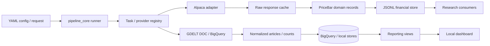

# Kinetic Trading

A cost-controlled financial and news-data research platform that ingests provider data, normalizes it into stable domain models, persists it deterministically, and exposes reproducible reporting workflows.

It is not a brokerage, order router, or profitability engine. The engineering focus is reliable ingestion, clear package boundaries, and guardrails that keep cloud and API costs under control.

[](https://github.com/KevinXT/kinetic-trading/actions/workflows/ci.yml)


## Technical highlights

- **Provider-neutral market-data models** (`PriceBar`, filings, facts, macro observations) with explicit logical identity, OHLC invariants, and currency-aware bar keys
- **Alpaca historical stock bars**: multi-symbol pagination, bounded retries, raw-page caching keyed by normalized API origin, and normalization into `PriceBar`
- **Deterministic JSONL storage**: atomic rewrite, exclusive writer locks, idempotent upserts, conflict detection, and semantic equality that ignores volatile `retrieved_at` metadata
- **Cost-aware BigQuery path**: dry-run estimates, SQL guardrails, partition pruning, query-size limits, and spending policy/ledger
- **GDELT news ingestion**: DOC/artlist path plus historical BigQuery counts, theme bundles, and local BI reporting views
- **Registry-based composition**: YAML pipelines, task registry, and per-invocation provider registries without global mutable provider state
- **Offline-first test suite**: fixture and fake-transport coverage for pagination, retries, cache, normalization, storage, and secret redaction; live Alpaca tests are opt-in

## Architecture



**Boundaries that matter:**

| Layer | Responsibility |
| --- | --- |
| `pipeline_core` | Config load, plan parse, task dispatch, artifacts — no provider knowledge |
| `market_data` / `news_data` | Provider clients, validation, normalization, domain-specific storage |
| `common` | Shared cache, YAML merge, cost policy primitives |
| `trading_platform` | CLI composition root and task registration |

Only normalized records cross provider boundaries. Raw Alpaca pages stay behind the adapter; downstream code consumes `PriceBar`, not provider JSON.

Alpaca and GDELT are separate paths that share the same runner and artifact conventions.

## Reliability and engineering decisions

- **Cache raw pages before normalization** so retries and re-runs do not re-hit the provider for identical historical requests, and page boundaries remain inspectable.
- **Include normalized `api_origin` in Alpaca cache identity** so production, sandbox, mocks, and proxies cannot share entries. Schema version `alpaca-bars-v2` invalidates older keys.
- **Bound pagination and retries** with maximum page counts, token-loop detection, exponential backoff caps, and non-retry of ordinary 4xx failures.
- **Logical keys drive idempotent storage.** Bars key on symbol, timestamp, timeframe, provider, feed, adjustment, and currency. Legacy rows without `currency` default to `USD` for key matching; reads do not rewrite the file.
- **Semantic upsert equality excludes `retrieved_at`.** Force-refreshing identical OHLCV data is counted as skipped and keeps the original `retrieved_at` (first-seen provenance), instead of reporting a false market-data correction.
- **Atomic writes + exclusive locks** protect local JSONL datasets from torn writes and concurrent writers.
- **BigQuery dry runs and cost caps** fail closed before expensive scans; partition filters are required for research configs.
- **Secrets stay in environment variables.** Cache keys, logs, artifacts, and examples carry env var *names*, never credential values.
- **Live provider tests remain opt-in** (`RUN_PROVIDER_INTEGRATION_TESTS=1` plus Alpaca credentials). CI runs the offline suite only.

**Currency caveat:** optional Alpaca `currency` is forwarded as the requested ISO-4217 price denomination (Alpaca documents default `USD`). Kinetic stores that value on `PriceBar` for identity. It does not model exchange rates or assert how Alpaca derives non-USD prices.

## News × market research-data layer

A normalized, leakage-aware research layer (`packages/research_data`) joins GDELT news
features to Alpaca market-session features. It is a **derived product**: it never
replaces either normalized source dataset, and it is not a trading signal.

```text
GDELT articles / historical topic counts
                ↓
normalized topic features (NewsTopicDailyFeature)
                ↓
market-calendar + availability alignment (SessionNewsFeature)
                ↓
Alpaca market-session features (MarketSessionFeature)
                ↓
versioned news×market research observations (NewsMarketObservation)
                ↓
offline event-study report + dataset manifest
```

- **Row grain:** one `topic × instrument × aligned market session × information cutoff × dataset version`.
- **Alignment policy:** `session_information_window_v2` — timestamped DOC news is
  aggregated over `[previous session close → feature_cutoff]`, where the default
  cutoff is five minutes before the target open. Equality at the cutoff is allowed.
  The buffer is operational conservatism, not a provider-latency model.
- **DOC vs BigQuery:** DOC/artlist supports article-level breadth, source concentration,
  syndication, and publication-timing features. BigQuery GKG counts support only volume;
  unsupported richer fields are emitted as `null` (never a fabricated `0`), tagged by
  per-row `feature_capabilities`. BigQuery rejects exact timestamp-window alignment
  unless an explicit downgrade to `daily_approximation` is enabled and recorded.
- **Feature groups:** every field belongs to exactly one category — identity, lineage,
  availability, **input** (lag-only), **contemporaneous** (same-session, not a predictor),
  **forward target**, quality, or diagnostic. Definitions live in
  `configs/research/news_market_feature_catalog.yaml` and are emitted as `feature_catalog.json`.
- **Targets:** target-session return / absolute return / Parkinson variance /
  benchmark-adjusted return, plus target-through-plus-4 cumulative and
  benchmark-adjusted returns, with explicit completeness flags.
- **Event study:** attention events are defined by a lag-only `attention_zscore_30 ≥ threshold`
  rule (config-driven, not chosen after seeing returns). H1/H2 are confirmatory;
  H3–H5 and subgroup analyses are exploratory. Eligible H1 inference uses a
  session-date moving-block bootstrap and BH correction only within the H1 endpoint
  family; undersized groups have null CIs/p-values.

Deterministic offline demo (no Alpaca / BigQuery / GDELT / internet):

```bash
python3 -m trading_platform configs/research/news_market_dataset_demo.yaml
```

Artifacts (per run, not committed): `news_topic_daily_features.jsonl`,
`session_news_features.jsonl`, `market_session_features.jsonl`,
`news_market_observations.{jsonl,csv}`, `feature_catalog.json`, `dataset_manifest.json`,
`join_summary.json`, `event_study_events.jsonl`, `event_study_summary.{json,csv}`, and
`research_limitations.md`. Design rationale: [research dataset design](docs/research/news_market_dataset_design.md).

Representative joined observation (trimmed; input / contemporaneous / target are kept separate):

```json
{
  "topic": "semiconductors", "symbol": "AMD", "session_date": "2026-05-04",
  "alignment_policy": "session_information_window_v2",
  "feature_available_at": "2026-05-04T13:25:00Z",
  "feature_cutoff": "2026-05-04T13:25:00Z",
  "target_session_open": "2026-05-04T13:30:00Z",
  "cutoff_buffer_seconds": 300,
  "availability_assumption": "publication_timestamp_proxy_v1",
  "alignment_precision": "article_timestamp",
  "inputs": {
    "news_title_deduplicated_article_count": 2, "news_log1p_attention_count": 1.0986,
    "news_unique_domains": 2, "news_observed_copy_domain_hhi": 0.5,
    "news_duplicate_ratio": 0.0,
    "news_attention_zscore_30": null, "mkt_prior_simple_return": null
  },
  "contemporaneous": { "mkt_volume": 21168255, "mkt_true_range": 4.461, "mkt_close_location": 0.567 },
  "targets": {
    "target_session_return": 0.005708,
    "target_session_benchmark_adjusted_return": 2.08e-07,
    "target_through_plus_4_cumulative_return": 0.018931
  },
  "quality": { "target_through_plus_4_complete": true },
  "lineage": { "mapping_version": "news-market-mapping-v1", "news_measurement_method": "gdelt_doc_artlist" }
}
```

**Principal limitations:** GDELT coverage is a media-attention proxy, not measured
investor attention; DOC record caps can censor counts; topic tags and topic→instrument
mappings are researcher-defined (with survivorship/selection bias); daily bars cannot
reproduce intraday price discovery; benchmark-adjusted return is not factor-model alpha;
Amihud is a daily liquidity proxy, not order-book depth; correlation is not causation;
and multiple testing can manufacture false discoveries. No profitability, execution, or
transaction-cost modeling is included. Reported publication time is only a historical
availability proxy; indexing, timestamp revision, delivery, and live-pipeline latency are
not modeled. The curated 2018–2035 calendar is not an authoritative exchange schedule
and omits unscheduled closures. See the generated `research_limitations.md`.

## Demonstrated skills

| Skill | Where it shows up |
| --- | --- |
| API integration | Alpaca pagination, retries, rate limits, response validation, credential redaction |
| Data engineering | Normalization, schemas, idempotent ingestion, partition-aware BigQuery SQL |
| Platform design | Package boundaries, registries, strict config parsing, YAML composition |
| Reliability | Atomic writes, concurrency locks, cache semantics, failure-path tests |
| Cloud / cost control | BigQuery dry runs, query-size limits, budget policy and ledger |
| Testing | Unit, fixture, fake-transport, concurrency, and opt-in live integration tests |

## Quick start

Credentials are **not** required for the offline test suite or the local dashboard.

```bash
git clone https://github.com/KevinXT/kinetic-trading.git
cd kinetic-trading

python3 -m venv .venv
source .venv/bin/activate

python3 -m pip install -e ./packages/common \
  -e ./packages/pipeline_core \
  -e ./packages/news_data \
  -e ./packages/market_data \
  -e ./packages/research_data \
  -e ./packages/strategy_sdk \
  -e ./apps/trading_platform \
  -e ".[dev]"

pytest -q
```

Safe offline/demo workflows:

```bash
# GDELT DOC demo (network call to GDELT; no cloud credentials)
python3 -m trading_platform configs/demo.yaml

# Local BI dashboard over committed sample JSON (not live BigQuery)
cd apps/reporting_dashboard && python3 -m http.server 8000
# open http://localhost:8000
```

Optional live Alpaca historical bars:

```bash
export ALPACA_API_KEY_ID="..."
export ALPACA_API_SECRET_KEY="..."
python3 -m trading_platform configs/alpaca_daily_bars.yaml
```

Artifacts land under `experiments/<run>/` and normalized bars under `data/processed/market/market_bars.jsonl` for the example config.

Optional BigQuery research configs (partition-pruned; require a real project id via `configs/local.yaml`):

```bash
python3 -m trading_platform configs/research/inflation_rates_bigquery_7d_partition_dryrun.yaml
python3 -m trading_platform configs/research/inflation_rates_bigquery_30d_partition_dryrun.yaml
python3 -m trading_platform configs/research/inflation_rates_bigquery_30d_partition_execute.yaml
python3 -m trading_platform configs/research/inflation_rates_bigquery_1y_partition_dryrun.yaml
python3 -m trading_platform configs/research/debug_gdelt_themes_inflation_30d_partition_dryrun.yaml
python3 -m trading_platform configs/research/debug_gdelt_themes_inflation_30d_partition_execute.yaml
```

Theme codes for research topics live in `configs/gdelt_theme_bundles.yaml` (theme bundle mappings). Dry-run first; execute configs are explicitly gated.

## Example configuration and output

Minimal Alpaca request shape (`configs/alpaca_daily_bars.yaml`):

```yaml
providers:
  market:
    alpaca:
      base_url: "https://data.alpaca.markets"
      key_id_env: "ALPACA_API_KEY_ID"
      secret_key_env: "ALPACA_API_SECRET_KEY"

pipeline:
  ingest:
    source: alpaca_historical_bars
    provider: alpaca
    request:
      symbols: [SPY, QQQ, AAPL]
      timeframe: "1Day"
      start: "2026-06-01T00:00:00Z"
      end: "2026-06-30T23:59:59Z"
      feed: iex
      adjustment: all
```

Normalized bar fields (representative):

```json
{
  "symbol": "AAPL",
  "timestamp": "2026-06-02T04:00:00Z",
  "timeframe": "1Day",
  "open": 200.0,
  "high": 205.0,
  "low": 199.0,
  "close": 204.0,
  "volume": 1000,
  "provider": "alpaca",
  "feed": "iex",
  "adjustment": "all",
  "currency": "USD",
  "retrieved_at": "2026-07-01T12:00:00Z"
}
```

## Repository map

```text
packages/
  common/            Shared YAML merge, cache, errors, cost policy/ledger
  pipeline_core/     Runner, parser, hooks, RunContext, task registry
  news_data/         GDELT DOC + BigQuery path, transforms, reporting views
  market_data/       Domain models, Alpaca adapter, JSONL financial store
  research_data/     News×market research layer: calendar, alignment, features, join, event study
  strategy_sdk/      Reserved boundary (intentionally empty)
apps/
  trading_platform/  CLI and task registration
  reporting_dashboard/ Static HTML/CSS/JS preview over sample reporting JSON
configs/             Demo, collections, research, Alpaca, reporting, cost policy
tests/               Offline suite + opt-in live provider test
docs/                Architecture and developer guides
```

## Testing and quality gates

CI (GitHub Actions) on Python 3.11 and 3.12. **Black** is the project formatter; **Ruff** is used for lint only (Ruff format is not enforced because it conflicts with Black on assert wrapping).

```bash
black --check packages/market_data packages/research_data packages/common/src/common/cache.py \
  tests/test_alpaca_*.py tests/test_financial_jsonl_store.py \
  tests/test_market_data_models.py tests/test_imports.py tests/test_research_*.py
ruff check .
mypy packages/common/src packages/market_data/src packages/pipeline_core/src packages/research_data/src
# wheel build + isolated venv import smoke (see CI)
pytest -q
```

The offline suite covers provider failures, pagination, caching (including API-origin isolation), normalization, registry composition, storage corrections, concurrency conflicts, artifact generation, config validation, and secret redaction. Live Alpaca calls require explicit opt-in and are skipped in CI.

Run locally:

```bash
pytest -q
black --check packages/market_data packages/research_data packages/common/src/common/cache.py \
  tests/test_alpaca_*.py tests/test_financial_jsonl_store.py \
  tests/test_market_data_models.py tests/test_imports.py tests/test_research_*.py
ruff check .
mypy packages/common/src packages/market_data/src packages/pipeline_core/src packages/research_data/src
```

## Current status and roadmap

### Implemented

- YAML pipeline engine with recursive includes and local overrides
- GDELT DOC ingestion, transforms, stores, and collection runner
- BigQuery GDELT counts/theme discovery with dry-run and cost guardrails
- Dashboard-ready reporting views and local sample-data dashboard
- Market-data domain contracts and JSONL persistence
- Alpaca historical US stock bars end-to-end (client → cache → normalize → store → artifacts)
- Normalized, leakage-aware news×market research-data layer with market-calendar alignment, feature catalog, offline event study, and dataset manifest

### Next

- Research-grade backtesting on top of the research-data layer
- SEC EDGAR and FRED provider adapters on the existing contracts
- Richer analytics over stored bars and topic features
- Rolling market-model (beta) expected returns and additional alignment policies

### Explicitly not implemented

- Live order execution or brokerage operations
- Profitability claims or autonomous trading
- Fully managed production data platform / multi-tenant SaaS
- Complete multi-provider market-data coverage beyond Alpaca bars

## Local dashboard


Screenshots use **committed sample JSON** matching the BigQuery reporting-view schemas. They are not live production feeds.

```bash
cd apps/reporting_dashboard
python3 -m http.server 8000
```

## Documentation

| Doc | Purpose |
| --- | --- |
| [Financial data architecture](docs/architecture/financial-data.md) | Domain identity, Alpaca path, cache, storage |
| [News×market dataset design](docs/research/news_market_dataset_design.md) | Research question, alignment, hypotheses, feature/leakage design |
| [Config builder](docs/guides/config-builder.md) | YAML `include:` / merge behavior |
| [Looker Studio setup](docs/looker_studio_dashboard.md) | Reporting views → Looker Studio |
| [Dependencies](docs/reference/dependencies.md) | Per-package dependency declarations |
| [Docs index](docs/README.md) | Full documentation map |
